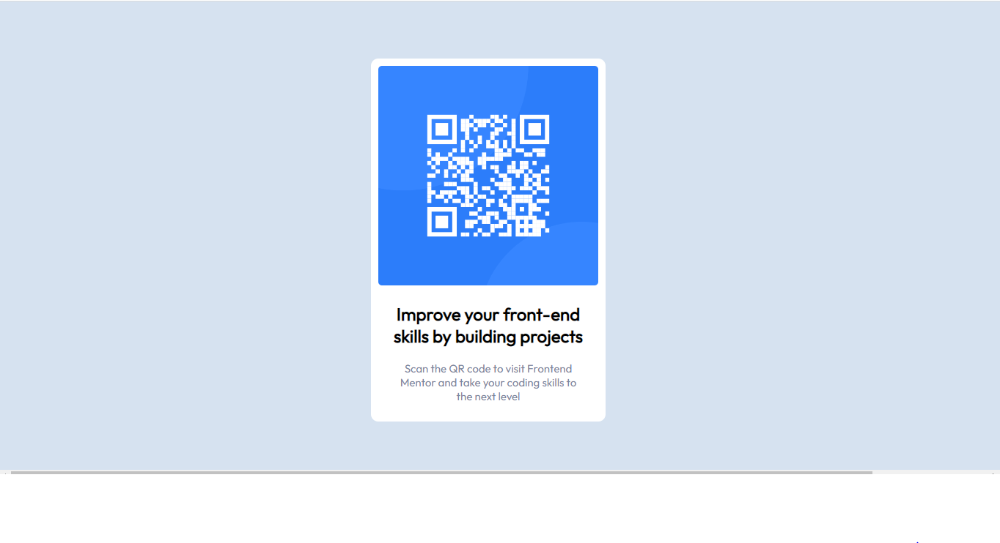

# Frontend Mentor - QR code component solution

This is a solution to the [QR code component challenge on Frontend Mentor](https://www.frontendmentor.io/challenges/qr-code-component-iux_sIO_H). Frontend Mentor challenges help you improve your coding skills by building realistic projects. 

## Table of contents

  - [Screenshot](#screenshot)
  - [Built with](#built-with)
  - [What I learned](#what-i-learned)
  - [Continued development](#continued-development)
  - [Author](#author)

### Screenshot

### Built with

- HTML5
- CSS 

### What I learned

i learned the hsl concept from doing this project, a big plus on my end.

### Continued development
 i will continue to improve the  whole project esp, placement of the picture at the center. I am not certain i did the right thing.

## Author

- Frontend Mentor - [@Omae1](https://www.frontendmentor.io/profile/Omae1)

